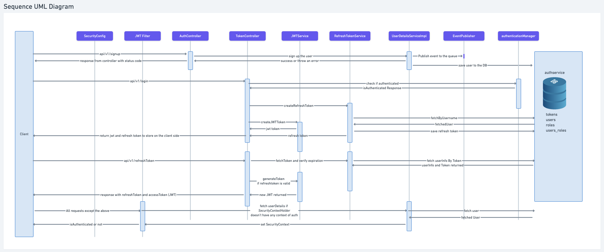

# 📊 expense-tracker-system

This document provides an overview of the **functional requirements, system architecture, authentication mechanisms, and database design** for the expense-tracker-system.

---

## 📌 1. Functional Requirements
- **User Authentication**: Users can **sign up and log in securely**.
- **Expense Management**:
  - Users can **add, update, and remove expenses manually**.
  - Expenses should be **categorized appropriately** (e.g., Food, Travel, Shopping).
- **Reports & Statistics**:
  - Users can view **weekly, monthly, and yearly reports**.
  - The system should provide **visual insights** into spending patterns.

---

## ⚙️ 2. Non-Functional Requirements
- **Performance**:  
  - The system should have a **latency of <100ms** for common operations.
- **Scalability & Fault Tolerance**:  
  - Handle a growing number of users and transactions.
  - Ensure **minimal downtime** with fault-tolerant architecture.
- **Security**:  
  - Implement **OAuth2 & JWT authentication**.
  - Store **passwords securely with Bcrypt**.
- **Config-Driven System**:  
  - Reduce code changes by using **dynamic configurations**.

---

## 🚀 3. Future Scope & Enhancements
- **Financial Insights**:  
  - Provide **personalized financial improvement tips**.
  - Track **spending behavior trends**.
- **Automated Expense Tracking**:  
  - Auto-extract expense data from **SMS messages** (with user permission).
- **Notifications & Alerts**:  
  - Send **WhatsApp & SMS alerts** for overspending, risk alerts, and reminders.

---

## 🏗️ 4. High-Level Design (HLD)

### 🔹 4.1 Authentication & Authorization
- **Authentication**: Verifies user identity (username/password or token validation).
- **Authorization**: Grants or denies access based on user roles.

### 🔹 4.2 Token Management
- **JWT (JSON Web Token)** for **access tokens**.
- **Opaque Tokens** (stored in DB) for **refresh tokens**.
- **Expiration Policies**:
  - **Access Token**: **15-minute** validity.
  - **Refresh Token**: **1-month** validity (stored securely).

### 🔹 4.3 Token Storage Options
| Storage Option | Security Level | Use Case |
|---------------|--------------|---------|
| **Cookies (HttpOnly, Secure)** | 🔒 High | **Recommended** for refresh tokens |
| **Local Storage** | ⚠️ Low | Vulnerable to XSS attacks |
| **Memory Storage** | ✅ Medium | Used for short-lived access tokens |

**Strategy**:
- **Access tokens** → Stored **in memory**.
- **Refresh tokens** → Stored **in secure HttpOnly cookies**.

### 🔹 4.4 Database Selection: SQL vs. NoSQL
| Criteria | SQL (PostgreSQL) | NoSQL (MongoDB/DynamoDB) |
|----------|-----------------|-------------------------|
| **Consistency** | ✅ ACID Compliance | ❌ Eventual Consistency |
| **Query Complexity** | ✅ Complex Queries Supported | ❌ Limited Querying |
| **Data Integrity** | ✅ Strong Schema | ❌ Flexible Schema |
| **Scalability** | ❌ Vertical Scaling | ✅ Horizontal Scaling |

**Final Choice**:
- **PostgreSQL** for structured transactional data (expenses, users).
- **Redis** for caching session data (fast lookups).

---

## 🔍 5. Low-Level Design (LLD)
### 📌 **LLD Diagram**

### 🔹 5.1 User Flow
#### 🔑 **Sign-Up Process**
1. User submits credentials.
2. System checks if username exists.
3. **Password is hashed** (Bcrypt) and stored.
4. **JWT access & refresh tokens** are generated.
5. Tokens are returned to the client.

#### 🔑 **Sign-In Process**
1. User submits credentials.
2. Password is verified.
3. A new **JWT access token** is issued.
4. **Refresh token** is used when access token expires.
5. User is authenticated and granted access.

---

## 🗄️ 6. Database Schema
### 📌 **ER Diagram**

### 🔹 6.1 Key Tables
- **Users** (stores user credentials and roles).
- **Expenses** (records transactions with timestamps).
- **Categories** (links expenses to specific spending types).
- **Tokens** (manages refresh token storage securely).

---

## 🛡️ 7. Security Considerations
- **Password Hashing**: Use **Bcrypt** to hash passwords.
- **Role-Based Access Control (RBAC)**:  
  - Admin → **Manage users, view reports**.  
  - User → **Manage personal expenses**.
- **Data Encryption**: Encrypt sensitive data at rest & in transit.

---

## ✅ Conclusion
This document provides a **structured approach** for developing the **Expense Tracker System**, covering:
- Functional & non-functional requirements.
- System architecture, database design, authentication strategies.
- **High-Level & Low-Level Design (HLD & LLD)** diagrams.