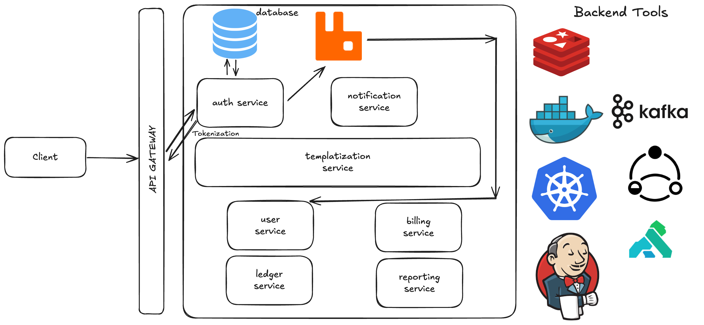

# expense-tracker-system

## 1. Functional Requirements
- **User Authentication**: Users should be able to **sign up and log in** securely.
- **Expense Management**:
  - Users should be able to **add and remove expenses manually**.
  - Users should be able to **view their expenses**, categorized appropriately.
- **Reports & Statistics**:
  - Users should be able to view **weekly, monthly, and yearly reports**.
  - The system should provide **visual statistics** of spending habits.

## 2. Non-Functional Requirements
- **Performance**:
  - The system should have a **latency of less than 100ms** for common operations.
- **Scalability & Fault Tolerance**:
  - The system should be scalable and **handle a growing number of users and transactions**.
  - It should be **fault-tolerant**, ensuring minimal downtime.
- **Config-Driven System**:
  - Reduce code changes by **making configurations dynamic** where possible.

## 3. Future Scope & Enhancements
- **Financial Insights**:
  - Users should be able to track their **financial behavior**.
  - The system should provide **personalized financial improvement tips**.
- **Automated Expense Tracking**:
  - The app should **parse SMS messages** (with permission) to automatically add expenses.
- **Notifications & Alerts**:
  - Send **WhatsApp and SMS notifications** regarding overspending, risk alerts, etc.

## 4. High-Level Design (HLD)

### Table of Contents:
1. **Authentication & Authorization**
2. **Tokens & Their Types**
3. **Choice of Tokens**
4. **Java Servlets & Security**
5. **Database Choice**
6. **Data Store Considerations**
7. **User Flow**
8. **Spring Security Implementation**

### 4.1 Authentication & Authorization
- **Authentication** verifies user identity (username/password or token validation).
- **Authorization** determines the resources users can access or modify.

### 4.2 Token Management
- **JWT (JSON Web Tokens)** for access tokens.
- **Opaque Tokens** for refresh tokens stored in a database.
- **Access Token (Short-lived)**: 15-minute expiration.
- **Refresh Token (Long-lived)**: 1-month expiration, stored securely.

### 4.3 Token Storage Options
- **Cookies vs. Local Storage**:
  - Cookies provide better security (HttpOnly, Secure, SameSite policies).
  - Local storage is vulnerable to XSS attacks.
- **Strategy**:
  - Store **access tokens in memory**.
  - Store **refresh tokens in secure HttpOnly cookies**.

### 4.4 Database Selection: SQL vs. NoSQL
#### **SQL (MySQL/PostgreSQL) Benefits**:
- Strong **consistency (ACID properties)**.
- Ideal for **complex queries and transactional data**.
- Ensures **data integrity** and avoids duplication.

#### **NoSQL (MongoDB/DynamoDB) Benefits**:
- **High availability** and partition tolerance.
- Efficient for **read-heavy operations** and unstructured data.

#### **Choice:**
- Use **PostgreSQL** for structured transactional data (expenses, user info).
- Consider **Redis for fast token lookups** (session management).

### 4.5 User Flow
#### **Sign-Up Process**:
1. User submits credentials.
2. System checks for existing username.
3. Password is **hashed with Bcrypt** and stored.
4. Access and refresh tokens are generated.
5. User service stores user details.
6. Tokens are sent to the client.

#### **Sign-In Process**:
1. User submits credentials.
2. Password is verified.
3. New JWT access token is issued.
4. If access token expires, refresh token is used to get a new one.
5. User is authenticated and allowed access to resources.

## Conclusion
This document provides a **structured approach** for developing the Expense Tracker App, covering functional, non-functional, and future requirements. It includes authentication strategies, token management, database choices, and user flows. This serves as a solid foundation before moving into Low-Level Design (LLD) and implementation.

